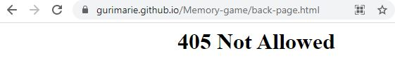

# MEMORY-GAME
## Match six equations with their answers, in under 1 minute

This is the website for a game where 12 cards, and each card is randomly assigned one of a pair of random equations and their respective answers. By opening two cards at a time, the user will for each game try to locate 6 equations and the answer that is correct for each equation. For example, if one card has the equation 5 x 5, the corresponding answer-card will have the value of 25. The two cards must be opened together, in order to count as a match. The user opens two and two cards, trying to find and open the correct pairs.

To adde to the games difficulty, there is a timelimit of 1 minute to find and open all the pairs, and there is also a limit regarding how many cards you may open without finding a pair (see user-instructions by clicking on the questionmark-button in the top right of the website.) 

Click [here](https://gurimarie.github.io/Memory-game/) to view the website

## User Experience (UX)

### User stories:

### First time visitor goals
The user is curious and pushes the buttons. Reads the instructions and tries the game.

### Returning visitor goals
When the game is up and running, it will be an enjoyable game to gome back to. Strethcing the brain a little, while there are options to guess from, so not too hard. But still on the clock... 

### Frequent user goals
In the future there will be an option to log in to keep track of past scores, and chosen color-scheme, and to compare with other players. Always with the possibility of new and crazy colour-schemes, and a little stimuli for the brain is always good.

### Site owner goals
The site-owner enjoys working out the brain a little, as long as it is fun, and not too hard, so as long as the users (including the owner) are enjoying themselves, the project-scope is reached.

## Design

### Colour scheme:
The colour-scheme is randomized, so that the user may choose a setting that pleases them or that fits their mood when playing. The colours are picked at random from all the possible colours in the RGB-system, and the user may press the button as may times as they wish, until a pleasing colour emerges. Or they may stay with the default blue-tones that are there when the website is loaded or refreshed.  

### Typography:
The font Permanent Marker has a juvenile and almost grafitti-like aspect to it, and it is well suited for the colourful and sometimes psychedelic colour-combinations that form when we use the random-colour-button. It also seems to have a fast and "in motion"-feeling, that works well with the speed needed to complete the task at hand in less that 1 minute. 

### Imagery:

Currently there are no images added to the game, only colours.

## Wireframes

## Features

- ### Random colours
Press the painters-button to add new colours randomly to all the "game-cards" and to the background-color of the website. Keep clicking, until you find a combination you like! :)

- ### Instructions
Instructions for how to play are added in a modal, in order to keep the webpage itself clean and less distractive (than it would have been with instructions). Click somewhere outside modal to go back to game.

#### Future features:
- There are 6 pairs to be found on the game-board, and the numbers making up the questions and answers are currently static (same 6 equations in every game), but in the future they will be randomized to create new equations each time the game is started. 
- Increasing difficulty (if player does well)
- Possibility to choose between several different game-question-types. Different math-questions matching questions with correct answer (either addition, subtraction, miltiplication or divison), mathing chemical formulas with correct name, matching two parts of a famous quote, and much more.
- Option to play as guest, or to log in with user, to keep track of scores, see other users best scores, and keep chosen colour-schemes (the login-feature is added, but not functioning yet).
- A beeper that makes a noise every second for the last 10 seconds of each game (with option to turn sound off).

## Issues overcome

### Instructions for playing
Instructions for playing the game have been added as a modal, overlaying the whole page. This option has been chosen, in order to be able to explain the game, without having a lot of tekst on the page. The modal is triggered by clicking the question-mark-button on the top right.

### Media-query
Added a media-query to scale main headline (h1) to fit better on smaller and larger devices. 

### "Flipping" the cards
I have looked at several solutions, including having two cards on top of each other and flipping the top one to reveal the bottom one, but I decided to go with transparent text on the cards when "unflipped", and black text when "flipped". It is a simple solution, and it does the trick. 

### Random colours sometimes gives poor readability
Having completely random colours on cards and background, sometimes made the black text poorly visible, due to low contrast. I have therefore removed the darkest colours from the random colour-generator by only allowing colours above 100 on each of the RGB-channels (full range is 0-256, where the smaller numbers are more saturated).

## Technology used
### Programming languages:
- HTML
- CSS
- Bootstrap
- jQuery

### Frameworks, libraries and programs:
- Bootstrap
- Google Fonts
- Font-awsome
- YouTube
- www.w3schools.com

## Testing

### Validation:
#### HTML validation
Html-content checked with https://validator.w3.org/nu/#textarea

#### CSS validation
CSS tested with W3C CSS Validator Service. 

#### JS validation
Tested with the JS-validator (https://jshint.com/). No errors, but the validator remarks that the code needs "ES6 (use 'esversion: 6') or Mozilla JS extensions (use moz)", and that "'arrow function syntax (=>)' is only available in ES6 (use 'esversion: 6')."

### Testing for user stories in UX-section:

### Further testing:
#### Test on different screen sizes:
There is a problem with alignment on larger devices. If starting a new I would have chosen to make the cards in css-grid or directly in JavaScript instead of in html.

#### Test on different browsers:
Tested in Chrome, Firefox and Edge, and the game works fine in all these browsers, but the card-sizes are un-even in Firefox (alignment-problem).

"405 Not allowed"-error on login:
 
The login-function is not operational, but trying to log in is supposed to lead to the error-page "pack-page.html" that has a button to return to the game, but it currently leads to a "405 Not allowed"-page, even though the URL-address is correct. The error comes when accessing the page through the git-hub-pages-address (both Firefox and Chrome), not when opening to browser directly from Visual Studio Code.

 

## Fixed bugs:
### Problems with alignment in game-area:
There was a problem with the horisontal alignment of the game-cards in the game-area, they were not in center.

I added classes container-fluid to full-page-divs, and container to game-area-div, and took away margins. This made the alignment somewhat better on large viewports, and much better on mobile and medium devices, but still not centered.

I fixed the horizontal alignment-issue on larger screens by using bootstrap-rows and columns on my game-card-divs, but though this layout worked fine on larger screens, it was still not good on smaller screens. 

Therefore I decided to start in the other direction, and make 3 columns in smaller devices, and add the fourth column in on medium and larger devices, using “d-none”-class on the ones that should not be seen in small devices. This works fine on mobile, but not perfect yet on larger screens (the last column is smaller).

The issue was finally solved with class="col-3 col-lg-2” for the three first boxes in each row, and class="d-none d-lg-block” for the fourth box.

### Problem with colour-picker
The random colour-button stopped working for a while, but it turned out to be because of empty functions in script.js that I had made as I planned the structure of how the finished JavaScript would be. One extra, open parentheses stopped the file from working. 

## Unfixed bugs:

### Matched-cards-sound
When some cards are matched, the Matched-cards-sound is not triggered. Especially in "narrow view" (only 3 cards per row)

### There should be a time-out before overlay can be clicked away
A time-out on the eventListener for click on the overlays, doen't work, as it  only gives time-out once, when first loaded. Must be triggered on every call (at least on the game-over-overlay).
I have added a time-out to the gameOver-function, but it is not functioning yet.

### Start of timer-countdown
The timer starts when you click on the "Start game"-overlay. It would be better if it would not start until first card-click, but I have not solved this issue yet. 

### Get 405 Not allowed-error on login
The login-function is not operational, but trying to log in is supposed to lead to the error-page "pack-page.html" that has a button to return to the game, but it currently leads to a "405 Not allowed"-page, even though the URL-address is correct. The error comes when accessing the page throug the git-hub-pages-address (both Firefox and Chrome), not when opening to browser directly from Visual Studio Code.

## Deployment
This project was developed using Visual Studio Code, committed to git and pushed to GitHub using git-extensions in Visual Studio Code.

### Steps to deploy this page to GitHub Pages from GitHub repository:
1. Log into GitHub.
2. Find the project "Memory-game" from the list of repositories and open it.
3. Go to the “Settings”-option.
4. Scroll down to the section called “Pages” in the menu on the left side, and click it to open the Github-pages page.
5. Under "Source", select the correct branch (in this case, “main”), and click on the Save-button.

6. The page will refresh, and the message on top says:
“Your site is ready to be published at: https://gurimarie.github.io/Memory-game/”
Use this link to access the deployed website.

### Making a local clone:
1. Follow this link to the [projects Github repository](https://gurimarie.github.io/Memory-game/)).
2. Under the repository name, click the green "Code"-button, and choose "https" and click on the "Download Zip"-option.
3. When the zip is downloaded, open the folder, and move the unzipped folder to where you wish to store it on your computer.
4. Open your Visual Studio Code (or other programming-software), click File, Open Folder, and choose the unzipped folder you just downloaded from where you saved it to.
 
### Forking the GitHub repository:
1. Log into GitHub.
2. Find the project "Memory-game" from the list of repositories and open it.
3.	In the top-right corner of the page, click Fork.

4. Then navigate to your fork of the Memory-game"repository, and download it by clicking on the "Code"-button like in the instruction for making a local clone, above. Choose "https" and click on the "Download Zip"-option.
3. When the zip is downloaded, open the folder, and move the unzipped folder to where you wish to store it on your computer.
4. Open your Visual Studio Code (or other programming-software), click File, Open Folder, and choose the unzipped folder you just downloaded from where you saved it to.

## Credits

### Code:
- Random-color-function from AndreFelipeCL, found at "https://stackoverflow.com/questions/20553036/random-color-in-jquery"
- README-structure heavily insipred by https://github.com/PaulFrankling/discover-north-yorks.
- Code Institute courses for everything
- https://getbootstrap.com/docs/4.1/components/ for modal and info and examples of different grid-options and visibility.
- Overlay-details (html and CSS) from YouTube-channel "Web Dev Simplified", video "How to Code a Card Matching Game"
- https://www.w3schools.com/jsref/prop_element_classlist.asp
- https://developer.mozilla.org/en-US/docs/Web/JavaScript/Reference/Operators/Remainder
- Modal Login Form from https://www.w3schools.com/howto/howto_css_login_form.asp

#### Tutorials for memory-game:
- Adam Khoury, Memory Game Programming JavaScript Tutorial, YouTube (https://www.youtube.com/watch?v=c_ohDPWmsM0)
- PortEXE, How To Code A Card Game In Plain JavaScript - Spooky Halloween Edition, YouTube (https://www.youtube.com/watch?v=3uuQ3g92oPQ&t=2044s)

### Media used:
- Sounds from Freesound.org
 
Flip-sound: https://freesound.org/people/Splashdust/sounds/84322/
 
Match-sound: https://freesound.org/people/Tuudurt/sounds/362445/
 
Victory-sound: https://freesound.org/people/FunWithSound/sounds/456966/
 
Game over-sound: https://freesound.org/people/noirenex/sounds/159408/

